# Mermaid Cheatsheet (for `/gen-readme-diagram`)

Verified Mermaid syntax for README-embedded diagrams. Every construct here renders on
GitHub, GitLab and Forgejo without a build step. Prefer these patterns over invented
syntax — a malformed block renders as a red error box, which is worse than no diagram.

## Minimal example

````markdown
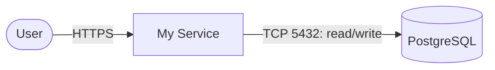
````

The fence must be exactly ` ```mermaid ` — lowercase, no attributes, no `{...}`.

## Node shapes

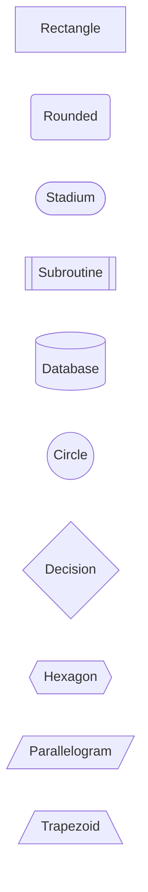

Conventional mapping used by this command:

| Element | Shape | Example |
|---|---|---|
| Human actor / client | stadium | `user([User])` |
| The application itself | rectangle | `app[Order API]` |
| Internal module | rounded | `store(store)` |
| Relational / document store | cylinder | `db[(PostgreSQL)]` |
| Cache | cylinder | `cache[(Redis)]` |
| Queue / topic / broker | hexagon | `bus{{Kafka}}` |
| Third-party SaaS API | rectangle | `stripe[Stripe API]` |
| Object storage | cylinder | `s3[(S3)]` |
| Scheduled trigger | circle | `cron((cron))` |

## Edges and labels

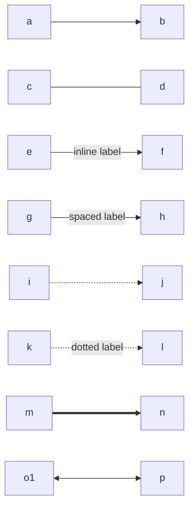

- `-->` solid arrow (default; use for "calls" / "writes to")
- `-.->` dotted (use for async / event / optional)
- `==>` thick (use for the primary happy path)
- `<-->` bidirectional (use for read-through caches, duplex streams)

**Label every edge** with protocol and purpose: `-->|"HTTPS: submit order"|`, not a bare `-->`.

## Subgraphs and direction

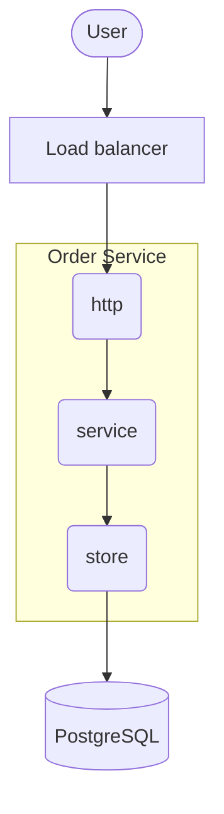

- Quote the subgraph title when it contains spaces: `subgraph app["Order Service"]`.
- Every `subgraph` needs a matching `end`.
- A nested `direction` applies inside that subgraph only.
- Edges may cross subgraph boundaries; declare them after the subgraph closes.

## Styling (theme-safe)

READMEs are read in both light and dark themes. A hardcoded light `fill` with no `color`
makes label text invisible in dark mode.

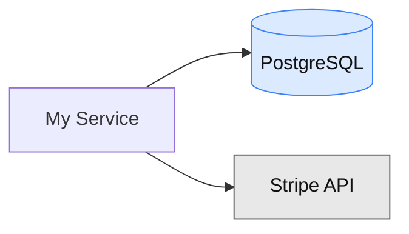

**Rule: set `fill`, `stroke` and `color` together, or set none of them.** Omitting styling
entirely is always safe and usually looks better — the host renderer picks theme-aware
defaults. Never use `style` on an id you also target with `classDef`.

## Sequence diagrams

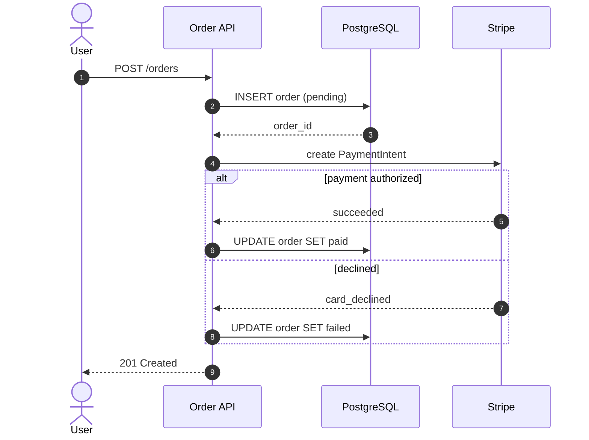

Arrows: `->>` solid with head (request), `-->>` dotted with head (response),
`-x` / `--x` async terminated, `-)` / `--)` async open.

Blocks that each require a closing `end`: `alt`/`else`, `opt`, `loop`, `par`/`and`,
`critical`/`option`, `break`, `rect`.

- Declare every lifeline with `participant` or `actor` **before first use**, using
  `participant SHORT as Long Label` so the arrows stay readable.
- Keep to <= 6 lifelines and <= 15 messages. One flow per diagram.
- `Note over A,B: text` for constraints worth calling out.

## ER diagrams

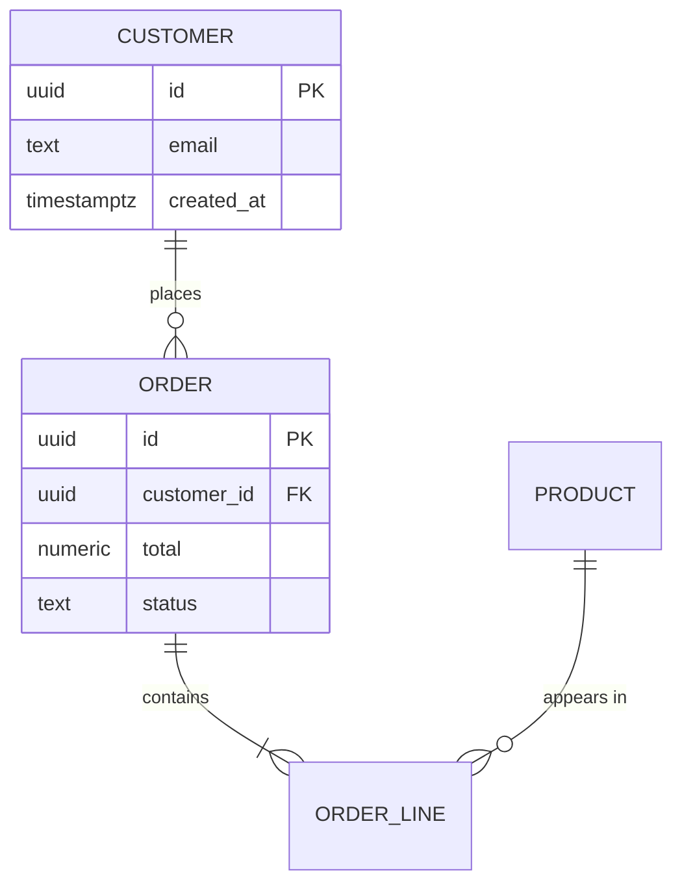

Cardinality tokens (left glyph mirrors the right):

| Token | Meaning |
|---|---|
| `\|o` / `o\|` | zero or one |
| `\|\|` | exactly one |
| `}o` / `o{` | zero or more |
| `}\|` / `\|{` | one or more |

`--` identifying relationship, `..` non-identifying. The `: label` is required — quote it
if it contains spaces. Entity names are conventionally UPPER_SNAKE_CASE.

## Syntax footguns

These are the failures that actually happen. Check every generated block against them.

1. **Reserved words as node ids.** `end` is the worst offender — it silently breaks the
   whole flowchart. Also avoid `graph`, `subgraph`, `class`, `classDef`, `click`, `style`,
   `linkStyle`, `direction`, `default`, and bare `o` / `x` (which parse as edge endings in
   `A---oB`). Suffix instead: `end_node`, `style_mod`.
2. **Unquoted punctuation in labels.** Any label containing `()`, `[]`, `{}`, `:`, `;`,
   `,`, `#`, `"`, `/` or `-->` must be quoted: `api["/v1/orders (public)"]`.
3. **Line breaks.** Use `<br/>`, never `\n`: `db[("PostgreSQL<br/>primary")]`.
4. **Literal quotes** inside a quoted label need the entity: `a["say &quot;hi&quot;"]`.
5. **Unbalanced `subgraph` / `end`**, and unclosed `alt` / `loop` / `opt` / `par`.
6. **Missing flowchart direction.** Always declare `flowchart LR` or `flowchart TB`.
7. **Undeclared sequence lifelines** — a typo'd participant silently creates a new column.
8. **Semicolons** are optional; do not mix styles within one diagram.
9. **Comments** are `%% comment` on their own line — `#` and `//` are not comments.
10. **Blank lines inside a `subgraph` body** render inconsistently on older GitLab; keep
    subgraph bodies contiguous.

## Renderer support

| Target | Renders ` ```mermaid `? |
|---|---|
| GitHub (repo README, issues, PRs) | Yes, native |
| GitLab (self-managed and .com) | Yes, native |
| Forgejo / Gitea | Yes, when enabled in `app.ini` markup settings (default on in recent releases) |
| <https://mermaid.live/> | Yes — use to debug a parser error |
| npm / PyPI / crates.io README viewers | **No** — block shows as plain text |
| VS Code preview | With the Markdown Preview Mermaid extension |

If the project publishes to npm or PyPI, mention in the section prose that the rendered
diagrams live on the repository page.

## Idiomatic templates

### System context — web service

The global view. The application is **one** node; actors left, dependencies right.

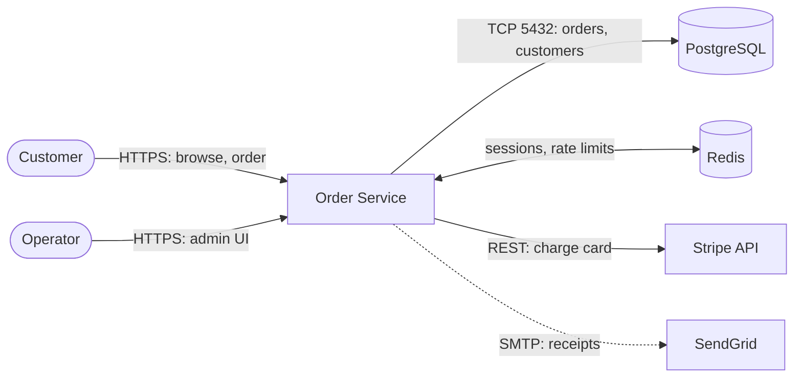

### System context — CLI tool

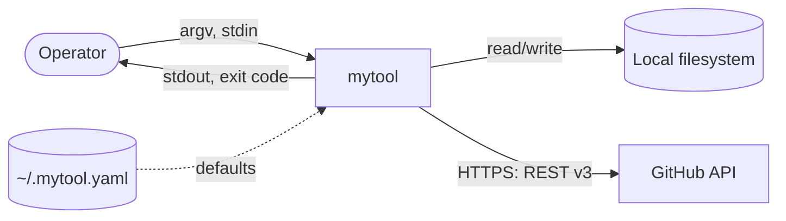

### System context — library

Only worth drawing when the library has real external dependencies.

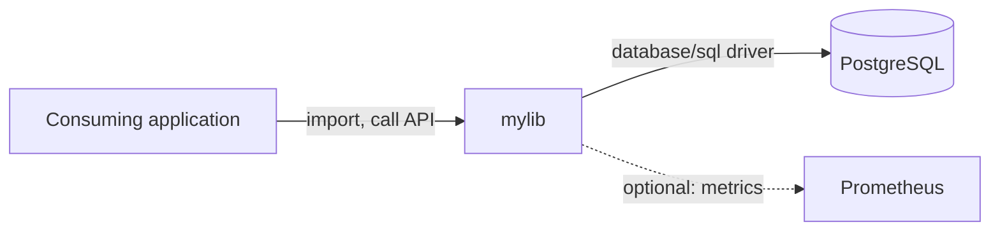

### Component view — layered service

Second diagram at tier `component`: opens the box, shows which module owns which dependency.

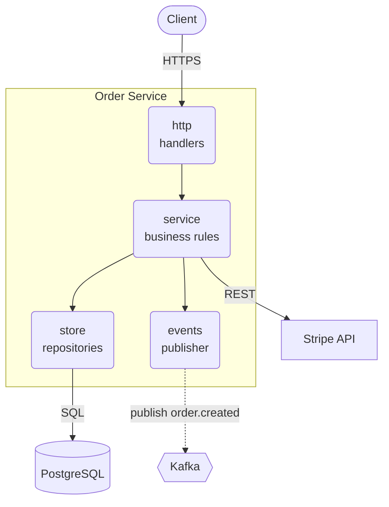

### Component view — multi-service

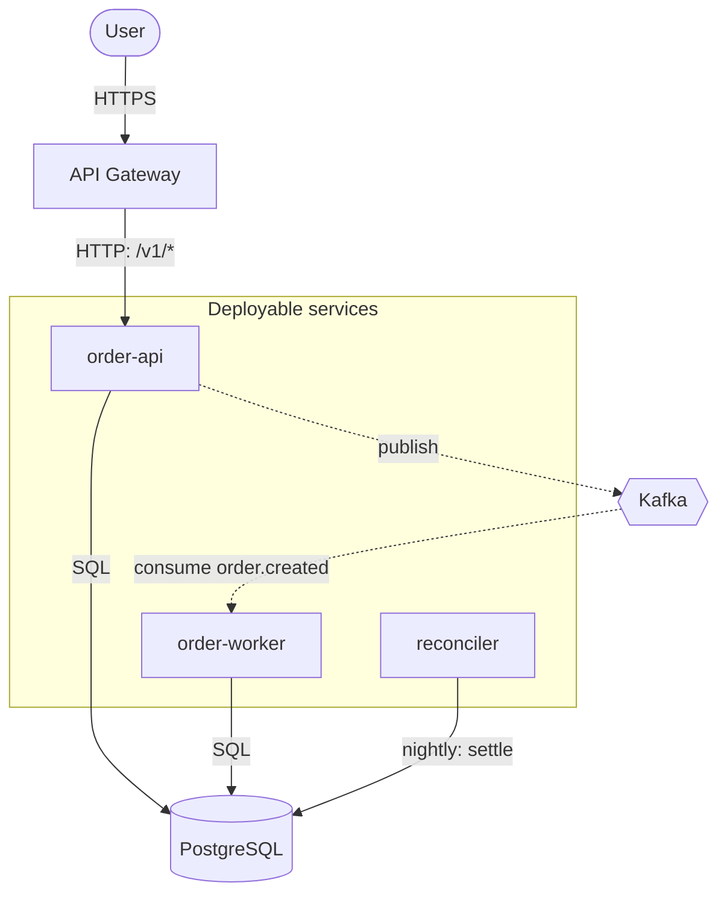

### Primary flow — sequence

Third diagram at tier `full`. Pick the single most important end-to-end path.

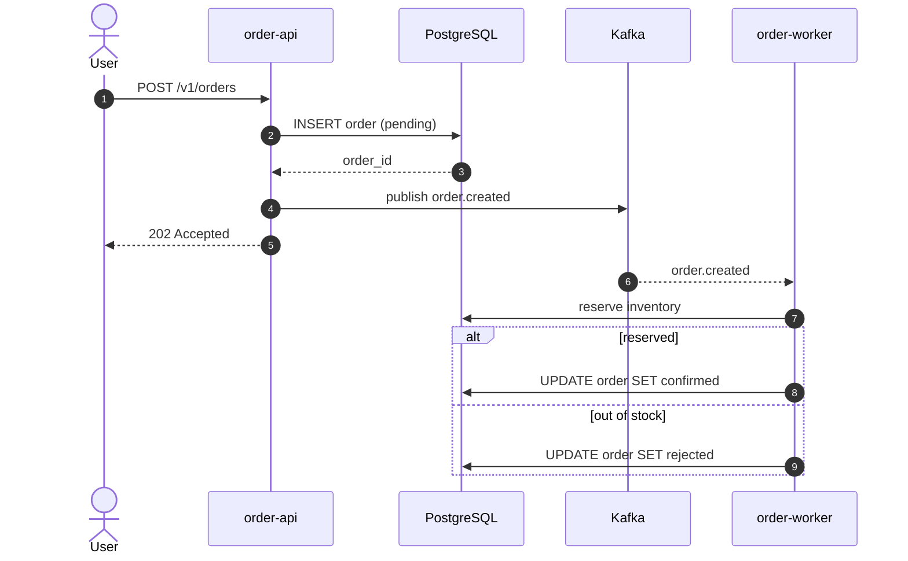

### Data model — ER

Fourth diagram at tier `full`, and only when >= 3 related entities were discovered.

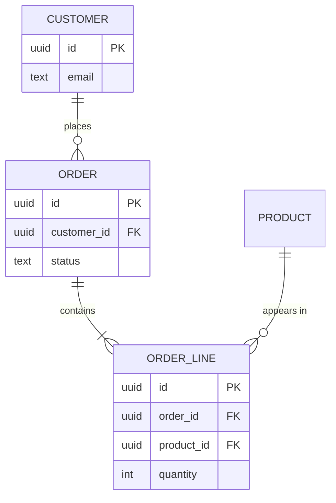

## Complexity to diagram set

| Score | Tier | Diagrams |
|---|---|---|
| 0, no external systems | `none` | none — prose only |
| 1-3 | `context` | system context |
| 4-7 | `component` | system context + component view |
| >= 8 | `full` | + primary flow, + data model (only if >= 3 related entities) |

## Rules of thumb the LLM must follow

1. One purpose per diagram. Never mix a flow and a topology in the same block.
2. The system context diagram renders the application as exactly **one** node. Internals
   belong in the component view.
3. <= 15 nodes per diagram, <= 4 diagrams total. Beyond that, point the reader at
   `/gen-diagram` instead of cramming the README.
4. Every edge carries a label naming the protocol and the purpose.
5. Short lowercase ids, human-readable quoted labels: `db[("PostgreSQL 16")]`.
6. `flowchart LR` for request/response and context views, `flowchart TB` for layering and
   containment.
7. Prefer no `classDef` at all; when styling, set `fill`, `stroke` and `color` together.
8. Never invent a dependency. Only draw systems that were actually found in the repo.
9. Precede each diagram with one sentence saying what the reader should take from it.
10. If a diagram would only restate the prose, omit it and say why.
